# 🔧 <span style="color:#00bfff">commit.js</span>
Handles the commit phase of a React-like rendering system.
This is where actual DOM updates, insertions, deletions, and side effects are applied.

---
## ✨ <span style="color:#ffa500">Features</span>
- 🧱 Appends or updates DOM nodes after fiber reconciliation

- 🗑 Safely removes deleted nodes from the DOM

- 🪄 Applies useEffect-like side effects and handles cleanups

- 🔁 Recursively traverses fiber tree for commit and effect execution

---
## 📚 <span style="color:#00bfff">API Reference</span>
🔹 commitRoot(wipRoot)
Commits the final fiber tree to the DOM and runs any effect hooks.

---
## 📝 Parameters
### 🔹 commitRoot(wipRoot: Fiber) → void

| 🧩 Parameter | 🔤 Type   | 📄 Description                                                                 |
|-------------|----------|-------------------------------------------------------------------------------|
| `wipRoot`   | `Object` | **Structure**:<br>- `dom`: Host DOM node<br>- `effectTag`: PLACEMENT/UPDATE<br>- `child`: First child fiber<br>- `alternate`: Previous version |

**Usage Example:**
```javascript
const wipRoot = {
  dom: container,
  props: { children: [element] },
  alternate: currentRoot
};
commitRoot(wipRoot);
```

---
## 🔙 Returns
Nothing (but updates the DOM and current fiber state)

🔹 commitWork(fiber)
Processes one fiber node: inserts, updates, or deletes it based on effectTag.

---
## 🧩 Effect Tags Handled:


| 🏷 Tag       | 📄 Behavior                          | 🔧 DOM Method Called               |
|--------------|-------------------------------------|------------------------------------|
| `PLACEMENT`  | DOM node insertion                  | `appendChild()`                    |
| `UPDATE`     | Prop diff and patch                 | `updateDom()`                      |
| `DELETION`   | Safe node removal                   | `removeChild()`                    |

🔹 commitDeletion(fiber, domParent)
Recursively finds and removes a DOM node associated with a fiber.

🔹 runEffects(fiber)
Runs useEffect-like hooks after the fiber tree is committed.

Cleans up old effects (if any)

Stores returned cleanup functions

---
## 🧠 <span style="color:#32cd32">How It Works</span>
#### Commitwork


#### Commitroot


## 📦 <span style="color:#ff6347">Dependencies</span>
updateDom – Applies prop differences to DOM

createDom – Generates DOM node for fiber

global.js – Manages deletions, root state

## 💡 <span style="color:#1e90ff">Example Commit Flow</span>
```
js

import { commitRoot } from "./commit.js";

// Assume fiber tree is built and wipRoot is ready
commitRoot(wipRoot);  // Applies DOM updates and runs effects
```
