# 🔧 <span style="color:#00bfff">dom.js</span>
Handles DOM node creation and updates in a React-like rendering system.
Supports attribute syncing, event listeners, inline styles, text nodes, and React-style fragments.

---
## ✨ <span style="color:#ffa500">Features</span>
- 🏗 Creates actual DOM elements from fiber nodes

- 🧼 Efficiently updates DOM attributes and event listeners

- 📝 Special handling for text nodes, inline styles, and input value

- 🧩 Handles fragments and function components gracefully

- 🔗 Supports ref object assignment (like React refs)

---
## 📚 <span style="color:#00bfff">API Reference</span>
🔹 createDom(fiber)
Creates a real DOM node based on the fiber's type and props.

---
## 📝 Parameters

| Parameter | Type   | Description                          |
|-----------|--------|--------------------------------------|
| `fiber`   | Object | A fiber node to process and render   |

---
🔙 Returns
A native DOM node (HTMLElement or Text)

null for Fragment or function components (handled elsewhere)

🔹 updateDom(dom, prevProps, nextProps)
Updates a DOM node by diffing previous and next props.

## 📝 Parameters

| Parameter    | Type       | Example                     | Description                          |
|--------------|------------|-----------------------------|--------------------------------------|
| `dom`        | `Node`     | `document.getElementById('root')` | Target DOM node to update |
| `prevProps`  | `Object`   | `{ class: 'old' }`          | Previous properties before update    |
| `nextProps`  | `Object`   | `{ class: 'new' }`          | New properties to apply              |

---
## 🔙 Returns
Nothing (applies changes directly to the DOM node)

---
## 🧠 <span style="color:#32cd32">Update Logic Overview</span>



🔁 What It Handles
✅ Text Nodes
Updates nodeValue if content changed.

✅ Event Listeners
Removes old listeners not present in nextProps

Adds new or changed listeners from nextProps

✅ Attributes
Removes attributes not in nextProps

Applies new attributes (style, value, etc.)

✅ Refs
If ref is an object ({ current: null }), it sets ref.current = dom

--
## 🧩 <span style="color:#cc00cc">Fragment Support</span>
```
js
if (fiber.type === Fragment || typeof fiber.type === "function") {
  fiber.dom = null;
  return null;
}
Skips DOM creation for <></> or component functions

Allows structural grouping without DOM clutter
```

## 📦 <span style="color:#ff6347">Dependencies</span>
Fragment – Special type for <></>

Standard DOM API – document.createElement, setAttribute, etc.

## 💡 <span style="color:#1e90ff">Example Usage</span>
```
js
const fiber = {
  type: "button",
  props: {
    onClick: () => alert("Clicked!"),
    style: { backgroundColor: "blue", color: "white" },
    children: [],
  }
};

const dom = createDom(fiber);
document.body.appendChild(dom);
```