# 🔧 <span style="color:#00bfff">performUnitOfWork.js</span>
Core function that drives the rendering and reconciliation of the fiber tree in a React-like system.
It processes each fiber node, attaches DOM if needed, and handles function vs. host components.

---
## ✨ <span style="color:#ffa500">Features</span>
- ⚛️ Differentiates between function and host components

- 🔁 Executes function components and triggers reconciliation

- 🏗 Creates actual DOM nodes for host components

- 🧭 Traverses the fiber tree in depth-first order

- 🪝 Initializes hook state (like useState, useEffect) for function components

---
## 📚 <span style="color:#00bfff">API Reference</span>
🔹 performUnitOfWork(fiber)
Processes a single fiber node and returns the next unit of work (DFS traversal).

## 📝 Parameters

| 🧩 Parameter | 🔤 Type   | 📄 Description                          |
|-------------|----------|----------------------------------------|
| `fiber`     | `Object` | A fiber node to process and render     |

---
## 🔙 Returns
fiber.child, fiber.sibling, or fiber.parent.sibling

Returns null if the traversal is complete

## 📚 <span style="color:#00bfff">Fiber Traversal</span>


## 📚 <span style="color:#00bfff">Component_Flow</span>


---
## 🧠 <span style="color:#32cd32">Logic Breakdown</span>
🟢 Function Components
```
js
if (typeof fiber.type === "function") {
  setWipFiber(fiber);
  setHookIndex(0);
  fiber.hooks = [];
  reconcile(fiber, [fiber.type(fiber.props)]);
}
```
Prepares for hook tracking

Executes the component to get children

Triggers reconciliation on output

🔵 Host Components
```
js

if (!fiber.dom) {
  fiber.dom = createDom(fiber);
}
reconcile(fiber, fiber.props.children || []);
```
Creates DOM node if missing

Reconciles actual children


---
## 📦 <span style="color:#ff6347">Dependencies</span>
createDom – Creates actual DOM nodes from fiber

reconcile – Compares and updates fiber tree

global.js – Hook state & current fiber tracking

---
## 💡 <span style="color:#1e90ff">Example Flow</span>
```
js
const next = performUnitOfWork(currentFiber);
// Next fiber will be processed in the work loop
```