# 🔧 <span style="color:#00bfff">reconcile.js</span>
Performs diffing and reconciliation between the previous and current virtual DOM trees using a Fiber structure.
Responsible for determining which nodes need to be placed, updated, or deleted.

---
## ✨ <span style="color:#ffa500">Features</span>
- 🔍 Compares new elements with old fibers for changes

- 🪄 Determines whether to PLACEMENT, UPDATE, or DELETION

- 🔗 Connects child and sibling relationships in the new fiber tree

- 🧹 Queues removed nodes for later deletion during commit phase

---
## 📚 <span style="color:#00bfff">API Reference</span>
🔹 reconcile(wipFiber, elements)

Compares the current fiber’s children with the previous fiber tree and builds a new fiber structure with change flags (effectTags).

---

## 📦 Fiber Reconciliation Parameters

| 🧩 Parameter  | 🔤 Type     | 📄 Description                                                                 |
|--------------|------------|-------------------------------------------------------------------------------|
| `wipFiber`   | `Object`   | The work-in-progress fiber being processed (contains `type`, `props`, `hooks`) |
| `elements`   | `Array`    | Child elements to reconcile (from component render output or JSX conversion)   |

---
## 🔙 Returns
Nothing directly.

Modifies wipFiber.child and builds a new tree of fibers with effectTags attached.

---
## 🧠 <span style="color:#32cd32">Effect Tags</span>

| Tag         | Description                                                                 | When Used                          |
|-------------|-----------------------------------------------------------------------------|------------------------------------|
| `PLACEMENT` | Node is new and should be inserted into the DOM                             | When new elements are created      |
| `UPDATE`    | Node exists and should be updated (props/children diff)                     | When elements change but keep type |
| `DELETION`  | Node is removed from tree and should be deleted (batched in `deletions[]`)  | When elements are removed          |

---
## 🔄 <span style="color:#1e90ff">Reconciliation Flow</span>


## ⚙️ <span style="color:#cc00cc">Internal Mechanics</span>
✅ Matching (Same Type)
```
js
const sameType = oldFiber && element && element.type === oldFiber.type;
```
✅ Creating New Fiber
```
js
newFiber = {
  type: element.type,
  props: element.props,
  parent: wipFiber,
  effectTag: sameType ? UPDATE : PLACEMENT,
};

```
✅ Handling Deletions
```
js
if (oldFiber && !sameType) {
  oldFiber.effectTag = DELETION;
  addDeletion(oldFiber);
}
```
## 📦 <span style="color:#ff6347">Dependencies</span>
PLACEMENT, UPDATE, DELETION – Effect tags from global.js

addDeletion – Stores deleted fibers for the commit phase

## 💡 <span style="color:#1e90ff">Example Context</span>


Used inside performUnitOfWork() when reconciling:
```
js
const children = [fiber.type(fiber.props)];
reconcile(fiber, children);
```
