# 🔧 <span style="color:#00bfff">render.js</span>
Responsible for initializing and managing the rendering lifecycle in a custom React-like fiber architecture.
Efficiently performs non-blocking rendering using requestIdleCallback and commits changes to the DOM.

## 📚 <span style="color:#00bfff">Overview</span>


### ✨ <span style="color:#ffa500">Features</span>
⚛️ Sets up root fiber and initiates the render process

🔁 Uses an asynchronous work loop via requestIdleCallback

🧠 Integrates fiber reconciliation with performUnitOfWork

📤 Commits completed fiber trees to the DOM using commitRoot

🧹 Handles deletions of old nodes efficiently

### 📚 <span style="color:#00bfff">API Reference</span>
🔹 render(element, container)
Initializes the rendering process by creating a root fiber and starting the work loop.

### 📝 Parameters
🧩 Parameter	🔤 Type	📄 Description
element	Object	Virtual DOM element to render
container	HTMLElement	DOM container to attach the root fiber

### 🔙 Returns
Nothing. It triggers internal rendering and commits DOM updates once ready.

### 🔄 <span style="color:#32cd32">workLoop(deadline)</span>
An internal scheduler function that performs fiber work during browser idle time.

### ⛓ How It Works:
Repeatedly processes performUnitOfWork for each fiber node

Yields to the browser if deadline.timeRemaining() < 1

When all work is done, commits the root using commitRoot

### 🧪 <span style="color:#32cd32">Internal State</span>
localDeletions: Temporarily stores nodes marked for deletion

getWipRoot(): Returns the root fiber currently being worked on

getNextUnitOfWork(): Returns the next fiber to process

setWipRoot(), setNextUnitOfWork(), etc.: Helpers for global fiber state

### 📦 <span style="color:#ff6347">Dependencies</span>
performUnitOfWork – Processes each fiber node

commitRoot – Commits fiber tree to actual DOM

global.js – Shared state for root, current fiber, deletions, etc.

### 💡 <span style="color:#1e90ff">Example Usage</span>
```
js
import { render } from "./render.js";
import { createNewElement } from "./createElement.js";

const element = createNewElement("div", null, "Hello Fiber!");
const container = document.getElementById("root");

render(element, container);
```